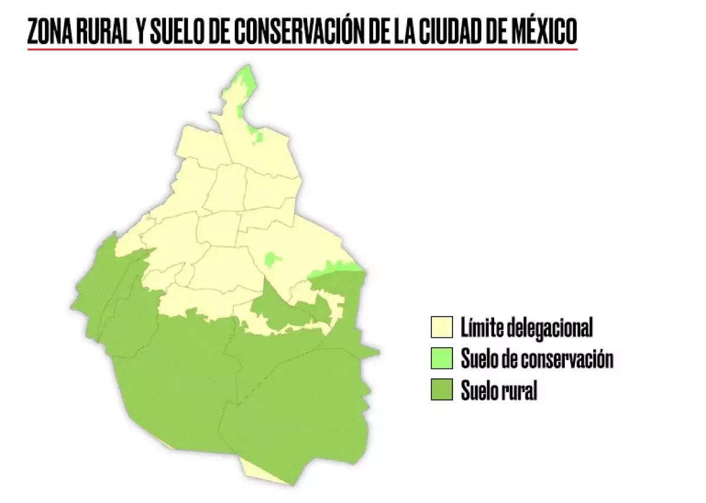

## [QUIZ:]{style="color:darkorange"}

- Many times the urban-rural categorization of space is not available at the level we need.

- [Cattaneo et al. (2022)](https://www.sciencedirect.com/science/article/pii/S0305750X22001310) propose a rural-urban metric based on access to cities.

  - If you need to travel 2 hours to find a city, then you leave in a 'more rural' area than if it took you only 1 hour.

  - They created a set of cells, all of them comprising a number between 1 to 30.

    - 1 is totally urban and 30 is totally rural.

Here, you will need to create a map of all the polygons (municipalities) in Istanbul. Greener colors must indicate [rural areas]{style="color:darkgreen"}, while [light yellow]{style="color:darkorange"} color indicates more **urbanized places**.

- [***To understand the process better, you must first write code to deal with Mexico City's map.***]{style="color: magenta"}

  - Then, you can proceed with Istanbul.

    - For Istanbul, [**I need the sea cells in blue**]{.underline}.

- Thus, in today's quiz you will first write some code for Mexico City, then you will reuse the same code to generate three maps (png-images) of Istanbul and upload the latter to SUCOURSE:

  1.  Urban Rural Continuum.

  2.  Urban Rural Municipalities.

  3.  Urban Rural Vectorization.

[**The Rural-Urban Continuum in Mexico City**]{.underline}

[Below, there is an image reflecting in green, the rural places in Mexico City. Let's try to recreate this map and then, we will color the corresponding municipalities according to their rural-urban nature.]{style="color:blue"}

{width="469"}

### **Guide for the Urban-Rural Continuum Activity**

### **Introduction**

In this activity, you will explore how to classify and visualize the urban-rural continuum in a geographic region using spatial data analysis techniques. The goal is to categorize areas based on their proximity to cities and their accessibility, following the methodology proposed by Cattaneo et al (2022).

### **Step 1: Load the Raster Data**

First, you will load the **urban-rural continuum** raster dataset, which provides a classification of space based on access to cities. This dataset contains numerical values from **1 to 30**, where **1 represents highly urbanized areas** and **30 represents the most rural areas**.

- Read the raster data file using the `rast()` function.

- Store the raster object in the variable `my_rast`.

```{r}

pacman::p_load(
  terra, # handle raster data
  tidyterra, # for integrating terra raster data with ggplot2 for visualization
  raster, # handle raster data
  sf, # vector data operations
  dplyr, # data wrangling
  tidyr, # data wrangling
  tmap, # for mapping
  tmaptools, # expands tmap
  here,
  geobounds
)  

my_rast = rast(here("urban_rur_catch.tif"))

```

### Step 2: Load and Process Vector Data for Mexico City

Next, you will obtain the administrative boundaries of Mexico’s municipalities and their centroids using the `geobounds` package.

- **Fetch Municipalities:** Use `gb_get_adm2()` to fetch the administrative level 2 boundaries for Mexico.

- **Generate Centroids:** Use the `sf` package to generate centroids from these municipal boundaries.

- **Filter for Mexico City:** Since the focus is on Mexico City, you must filter the global Mexico dataset:

  - **Extract State Boundaries:** Use `gb_get_adm1()` to fetch level 1 boundaries and filter the results to select only the **Distrito Federal** (or "Ciudad de México").

  - **Spatial Filter:** Use `st_filter()` to ensure that only municipalities physically located within the Mexico City state boundary are retained.

- **Finalize Dataset:** Join the filtered results with the municipalities' dataset to create the final object: `cdmx_map`.

```{r}
mex_municipalities <- gb_get_adm2("Mexico")
mex_states <- gb_get_adm1("Mexico")

cdmx_state <- mex_states %>%
  filter(shapeName %in% c("Ciudad de México", "Distrito Federal"))

cdmx_map <- st_filter(mex_municipalities, cdmx_state)
```

### **Step 3: Crop the Raster to Match Mexico City’s Boundaries**

Now that you have the **vector boundaries** of Mexico City, you will extract only the portion of the **urban-rural raster** that falls within these boundaries.

- Use the `crop()` function to clip the raster using `cdmx_map`.

- The result, `urb_rur_cdmx`, contains **only the relevant portion of the raster**.

```{r}


urb_rur_cdmx <- crop(my_rast, cdmx_map)


```

### **Step 4: Visualizing the Urban-Rural Continuum**

You will now create a **map showing the urban-rural classification** for Mexico City.

- Plot the cropped raster using `tm_raster()`.

- Assign **green colors to rural areas** and **light yellow to urban areas**.

- Overlay the **municipal boundaries** using `tm_borders()`.

- Add a **title and a legend** to improve the readability of the map.

```{r}

tm_shape(urb_rur_cdmx) +
  tm_raster(
    col.scale = tm_scale_continuous(values = c("lightyellow","green"))
  ) +
  tm_shape(cdmx_map) +
  tm_borders() +
  tm_layout(title = "Urban-Rural Continuum (CDMX)")

```

### **Step 5: Extracting Urban-Rural Information for Municipalities**

Instead of working with raster cells, we often want to **aggregate raster information into municipal boundaries**.

- Use `terra::extract()` to compute the **mean urban-rural value** for each municipality.

- Store the extracted values in a new column `rur_ind` within `cdmx_map`.

Now, you will **visualize the municipalities** based on their urban-rural classification.

- Use `tm_polygons()` to color each municipality according to its **urban-rural index**.

- Ensure that the color scheme matches the raster visualization.

```{r}

cdmx_map$rur_ind <- terra::extract(
  urb_rur_cdmx,
  cdmx_map,
  fun = mean,
  na.rm = TRUE
)[,2]

tm_shape(cdmx_map) +
  tm_polygons(
    col = "rur_ind",
    col.scale = tm_scale_continuous(values = c("lightyellow","green"))
  ) +
  tm_layout(title = "Urban-Rural Municipalities")

```

### **Step 6: Converting Raster Data into a Categorical Format**

You will now **classify the raster values into two categories**: **urban and rural**.

- Extract the raster values and convert them into a **data frame**.

- Apply a **median-based threshold**, where:

  - Areas **below the median** are **urban**.

  - Areas **above the median** are **rural**.

- Store the classified values in a new **categorical raster**.

Once the classification is complete, **create a stack raster** to combine the original and classified layers.

```{r}

cdmx_map$rur_ind <- terra::extract(
  urb_rur_cdmx,
  cdmx_map,
  fun = mean,
  na.rm = TRUE
)[,2]

```

### **Step 7: Converting Raster Data to Polygons**

The next step is to **vectorize** the classified raster.

- Use `as.polygons()` to **convert the raster into polygons**.

- Apply the `dissolve = TRUE` argument to **merge adjacent polygons** with the same classification.

- Convert the result into a valid `sf` object.

Now, visualize the **urban and rural polygons** alongside the raster.

- Use `tm_raster()` to plot the classified raster.

- Overlay the **vectorized polygons** using `tm_borders()`.

```{r}

tm_shape(cdmx_map) +
  tm_polygons(
    col = "rur_ind",
    col.scale = tm_scale_continuous(values = c("lightyellow","green"))
  ) +
  tm_layout(title = "Urban-Rural Municipalities")

```

### **Final Step: Apply the Same Process to Istanbul**

Once you have completed the analysis for Mexico City, replicate the same steps for **Istanbul**.

- Instead of Mexico City, use **Istanbul’s administrative boundaries**.

- Ensure that **sea areas are correctly classified** and **colored in blue**.

```{r}
vals <- values(urb_rur_cdmx)

threshold <- median(vals, na.rm = TRUE)

urb_rur_binary <- ifel(
  urb_rur_cdmx > threshold, 1, 0
)

```

```{r}
urb_rur_poly <- as.polygons(
  urb_rur_binary,
  dissolve = TRUE
) %>%
  st_as_sf()

```

```{r}

tm_shape(urb_rur_binary) +
  tm_raster(
    col.scale = tm_scale_discrete(values = c("lightyellow","green"))
  ) +
  tm_shape(urb_rur_poly) +
  tm_borders() +
  tm_layout(title = "Urban-Rural Vectorization")

```

### **Deliverables**

For this exercise, you need to submit a script that generates **three maps for Istanbul**:

1.  **Urban-Rural Continuum** – Raster representation of urban-rural classification.

2.  **Urban-Rural Municipalities** – Municipalities colored based on their classification.

3.  **Urban-Rural Vectorization** – Vectorized urban and rural areas from the raster dataset.

------------------------------------------------------------------------

### [Now that you have completed every step in the quiz, you must go to SUCOURSE to finish the activity.]{style="color: blue"}

------------------------------------------------------------------------

## Coding hints

Below you can find some critical code pieces that may help you get started.

```{r}

# ISTANBUL

# Load Turkey boundaries
tur_municipalities <- gb_get_adm2("Turkey")
tur_states <- gb_get_adm1("Turkey")

# Filter Istanbul
istanbul_state <- tur_states %>%
  filter(shapeName == "İstanbul")

istanbul_map <- st_filter(tur_municipalities, istanbul_state)

# Ensure CRS match
istanbul_map <- st_transform(istanbul_map, crs(my_rast))

# Crop raster
urb_rur_ist <- crop(my_rast, istanbul_map)


# Map 1

map1 <- tm_shape(urb_rur_ist) +
  tm_raster(
    col.scale = tm_scale_continuous(
      values = c("lightyellow", "green"),
      limits = c(1, 30)
    )
  ) +
  tm_shape(istanbul_map) +
  tm_borders() +
  tm_layout(title = "Urban-Rural Continuum (Istanbul)")

# Map 2: municipalities

istanbul_map$rur_ind <- terra::extract(
  urb_rur_ist,
  istanbul_map,
  fun = mean,
  na.rm = TRUE
)[,2]

map2 <- tm_shape(istanbul_map) +
  tm_polygons(
    col = "rur_ind",
    col.scale = tm_scale_continuous(
      values = c("lightyellow", "green"),
      limits = c(1, 30)
    )
  ) +
  tm_layout(title = "Urban-Rural Municipalities (Istanbul)")

# Map 3: vectorization

urb_rur_binary_ist <- ifel(urb_rur_ist > 15, 1, 0)

# Добавляем море
urb_rur_binary_ist[is.na(urb_rur_binary_ist)] <- -1

urb_rur_poly_ist <- as.polygons(
  urb_rur_binary_ist,
  dissolve = TRUE
) %>%
  st_as_sf()

map3 <- tm_shape(urb_rur_binary_ist) +
  tm_raster(
    col.scale = tm_scale_discrete(
      values = c(
        "-1" = "blue",        # sea
        "0" = "lightyellow",  # urban
        "1" = "green"         # rural
      )
    )
  ) +
  tm_shape(urb_rur_poly_ist) +
  tm_borders() +
  tm_layout(title = "Urban-Rural Vectorization (Istanbul)")

map1
map2
map3

```

```{r}
unique(tur_states$shapeName)
```
